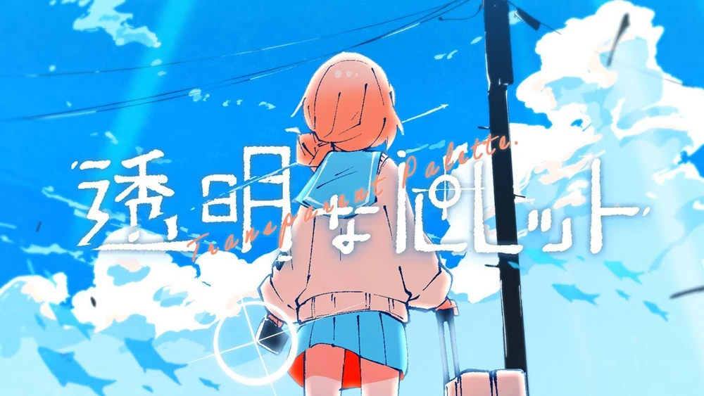

# CCLab page
 
 
<h2>2026.1-2026-5</h2>
 

 
<h3>Projects</h3>

- [Project A: transparent swimmer (tentative)](https://tenmei-k.github.io/ccl-vsc/project-a/)
         midterm: Generative Creatures
- [Project B: スター (Star)](https://tenmei-k.github.io/ccl-vsc/project-b/)
         finals: Dear future...
 
<h3>Exercises</h3>

- [MP6. Living Sketches](https://tenmei-k.github.io/ccl-vsc/living-sketches/)
         不思議な小アニメ
- [MP4. Generative & Interactive  Landscapes & Patterns](https://editor.p5js.org/Tenmei-K/full/8pUGHbxlJ)
         Project A前置
- [MP1. Drawing with Code](https://editor.p5js.org/Tenmei-K/full/MPbnCIZ6v)
         ドッペルゲンガー自画像